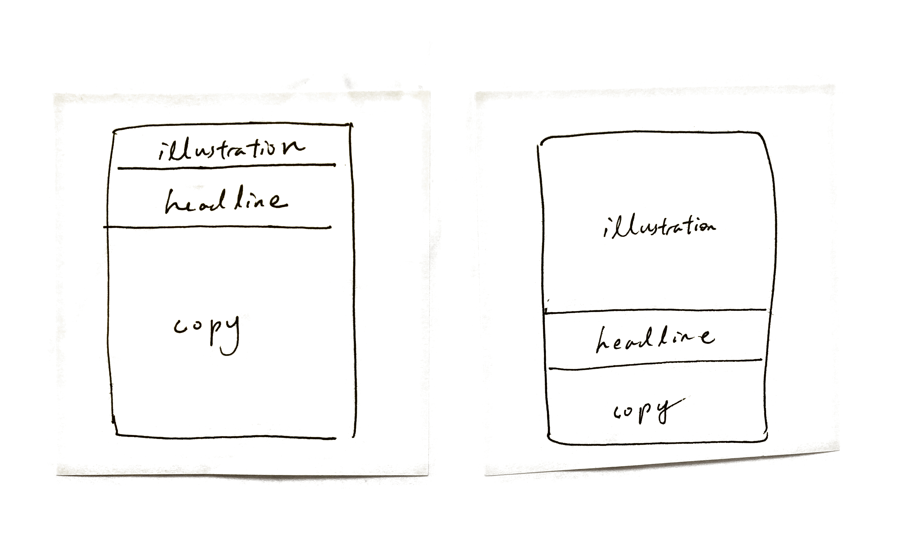

strategy
- advertising is not entertainment or an art form, but a medium of information
- do your homework
- the wrong advertising can actually reduce the sales of a product
- repeat your winners
- you need big ideas that can last for a decade: "Merrill Lynch is bullish on america"
- it pays to give most products an image of quality: a first class ticket
- if you and your competitors all make excellent products, don't try to imply that your product is better. just say what's good about your product: do a cleaner, more honest, more informative job of saying it
- people are most interested in what is happening where they live ("how SF people like coding!")
- "if it doesn't sell, it's not creative"
- advertise to the kind of customers you want
- "any fool can write a bad advertisement, but it takes a genius to keep his hands off a good one"
- every advertiser has the same problem: "to be believed"
- always try to include the price of your products
- "the more facts you tell, the more you sell"
- how to become a good copywriter: you copy others

illustration
- photographs > drawings
- keep illustration simple; focus on 1 person; crowd scenes don't pull
- people like illustrations they can identify with (ie. same sex)
- the subject of your illustration is all important
- if you don't have a remarkable idea for it, not even a great photographer can save you
- the kind of photographs which work hardest are those which amuse the reader's curiosity
- it pays to illustrate the end-result of using your product (before-and-after photos increase sales; by Gallup)

big idea
- did it make me gasp when i first saw it?
- do i wish i had thought of it myself?
- is it unique?
- does it fit the strategy to perfection?
- could it be used for 30 years?

headline
- headlines should promise a benefit, or deliver news, or offer a service, or tell a significant story, or recognize a problem, or quote a satisfied customer
- don't superimpose headlines onto illustrations
- don't use all-caps
- don't put a period on headlines
- brand name in headline
- headlines containing news are 22% better
- headlines offer helpful information
- headlines of ten words sell more than short headlines
- 5x as many people read the headlines as read the body copy

body copy
- long copy sells
- make ads look like editorial pages (increases readership)
- your first paragraph should be a grabber
- avoid analogies
- limit opening paragraph to 11 words
- don't address your readers as if they were gathered together in a stadium
- you can't bore people into buying your product
- short sentences; short paragraphs; avoid difficult words
- don't write essays
- write your copy in the form of a story

content
- commercials which contain news are above average
- products, like human beings, attract most attention when they are first born
- historical subjects bore people
- testimonials makes you more credible
- add caption to photos! use captions to sell!

style
- black type on white background
- a sub head of two lines, between your headline and body copy, heightens the reader's appetite for the feast to come
- start body copy with drop initial
- serifs > san-serifs
- faces: century family, caslon, baskerville, jenson
- "the eye is a creature of habit"
